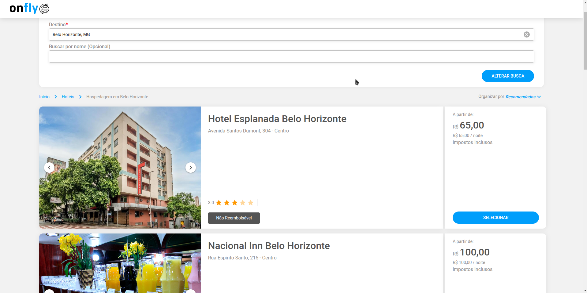

# Reservas

### Requisitos técnicos

- [x] Utilizar VUEJS
- [x] Utilizar Quasar para UI
- [x] Utilizar classes para os dados
- [x] Seguir o protótipo da tela
- [x] Busca de destinos com autocomplete
- [x] Filtro de ordenação para listagem (Recomendação e melhor avaliados)
- [x] Filtro por nome
- [x] Scroll inifinito

- [x] Utilizar typescript
- [ ] Aplicar testes unitários para os componentes

#### Form

- [x] Filtro de recomendados deverá ordenar os hotéis pelo preço.
- [x] Filtro de Melhor avaliados deverá ordenar os hotéis pelo número de estrelas

#### Listgem

- [x] Apresentar as imagens em um carrousel.
- [x] Ao chegar no final da página, carregar mais 10 hotéis.
- [x] Informe quando não há mais hotéis para listar.

#### Drawer

- [x] Criar um drawer para as informações detalhadas do hotel.
- [x] Utilizar novamente um carrousel para exibir as imagens do hotel e agora será necessário um contador das imagens.

### Técnologias utilizadas

- VueJS
- Quasar
- Typescript
- Sass
- Pinia (Gerenciamento de estados)

# O projeto

### Parte funcional

Foi feito o formulário para filtrar os hotéis, onde o usuário pode escolher um destino e também se quiser utilizar o nome do hotel.
Esse formulário pode ser enviado ao pressionar a tecla enter ou ao clicar no botão de busca.

Adicionei uma ordenação que vai filtrar os hotéis em recomendados ou melhor avaliados, a busca por recomendados vai exibir uma lista ordenada por preços na ordem crescente e a busca por melhor avaliados foi ordenada por estrelas na ordem decrescente.

A listagem possui scroll infito, ou seja, quando chegar próximo ao final é feito a busca por mais resultados e caso tenha finalizado os items, é exibido uma mensagem logo no final da lista.

O usuário pode clicar em selecionar e será exibido um drawer com todas as informações do hotel.

### Parte técnica

#### Estrutura de pastas

Foi utilizado a estrutura padrão do quasar, os arquivos principais estão dentro da pasta src:

- @types -> Foi utilizado para as declarações de tipos do typescript (Declara arquivos .json, pois o typescript não entendia eles no ínicio).
- assets -> Arquivos estáticos, eu utilizei essa pasta para deixar a logo que é exibida no header.
- boot -> Diretório do quasar para algumas configurações
- components -> Foi onde criei todos os componentes utilizados.
- form -> Aqui foi onde deixei os componentes específicos utilizados somente no formulário
- hotels -> Aqui são os componentes utilizados para exibir informações dos hotéis, tanto na listagem quanto no drawer.
- constants -> Criei esse diretório para adicionar constants que utilizaria ao longo do projeto, mas acabei utilizando somente um arquivo para fazer o mapeamento dos ícones.
- css -> Diretório do quasar, aqui é onde adiocionamos estilização global e variáveis no css do projeto.
- layouts -> Diretório do quasar, onde é possível criar um layout geral para a aplicação.
- pages -> Onde ficam as páginas do projeto, nesse caso utilizei somente uma página, não precisei de roteamento.
- router -> Onde é configurado o roteamento do projeto, não precisei mexer muito aqui pois só utilizei uma página.
- storage -> Aqui foi onde deixei os arquivos json com os dados dos hotéis.
- hotels -> Estão os arquivos para os dados dos hotéis, bem como a classe responsável por esse gerenciamento.
- places -> Estão os arquivos para os dados das cidades, bem como a classe responsável por esse gerencimaneto.
- stores -> É o diretório onde ficam os arquivos para gerenciamento dos estados globais da aplicação, nesse caso utilizei um para toda a listagem e filtros e outro para controlar o drawer.
- utils -> Onde deixei funções utilitárias, nesse caso, uma função para formatar valores.

#### Implementação

Como estou utilizando o quasar, não criei muitos componentes genéricos, ao invés disso dei preferencia para utilizar os que ele já disponibiliza e então criei componentes mais específicos. Para o formulário, utilizei os inputs, autocomplete e o button que criei customizando o componente button do quasar para que ficasse como eu precisava dele.
Para a listagem, utilizei o infinite-scroll do quasar, o carousel e o Drawer também foram do quasar.

Para gerenciamento dos filtros da listagem, optei por utilizar o pinia, uma biblioteca de gerenciamento de estados globais. É onde estão sendo carregados os hotéis e os filtros. Para os dados dos hotéis, criei uma classe no diretório storage que faz essa busca e gerenciamento dos filtros e então estou utilizando essa classe no meu estado global para que tenha a reatividade na tela.

Criei também um estado para o drawer, pois assim consegui ter somente um drawer na aplicação e ele não precisaria ficar em cada componente card.

Tive várias dificuldades nesse projeto mas isso me trouxe vários aprendizados também, o maior desafio foi utilizar o quasar que é uma tecnologia que ainda não tinha nenhum conhecimento e agora vi que existem um framework bem completo para vuejs, acredito que tenham formas melhores para fazer essa solução, configurações e padrões de utilizar o quasar, mas por enquanto estou bem satisfeito com essa implementação que consegui entregar e pretendo continuar evoluindo com essa tecnologia.

Para rodar o projeto, bata fazer o clone do repositório ou baixar os arquivos, é necessário ter o node acima da versão 16 instalado, abra a pasta do projeto no seu terminal e então rode alguns comandos, o comando `npm run install` para instalar as dependencias e o comando `npm run dev` para rodar em modo de desenvolvimento, no terminal vai aparecer um link em localhost para que possa visualizar o projeto no seu navegador.
